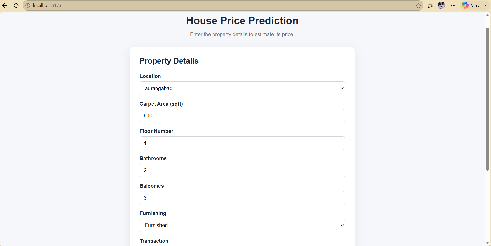
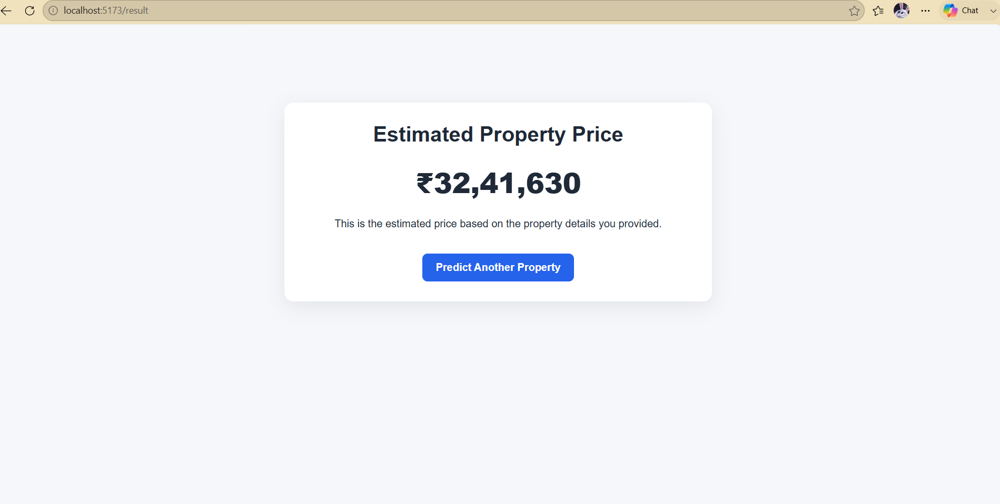

# 🏠 House Price Prediction

An end-to-end Machine Learning web application for predicting house prices based on property details.

The project covers the complete ML workflow, including data preprocessing, exploratory data analysis (EDA), feature engineering, model training and evaluation, model export, a FastAPI backend, and a React + TypeScript frontend.

---

## 📌 Project Overview

This project predicts house prices using property features such as:

* Location
* Carpet Area
* Floor Number
* Number of Bathrooms
* Number of Balconies
* Furnishing Status
* Transaction Type
* Ownership
* Facing

The trained machine learning model is integrated into a FastAPI backend and connected to a React frontend, allowing users to enter property details and receive a predicted house price.

---

## 🏗️ Architecture

```text
User
  │
  ▼
React + TypeScript Frontend
  │
  │ POST /predict
  ▼
FastAPI Backend
  │
  ▼
Preprocessing Pipeline
  │
  ▼
Trained ML Model
  │
  ▼
Predicted House Price
  │
  ▼
Frontend Result Page
```

---

## 🛠️ Tech Stack

### Machine Learning

* Python
* Pandas
* NumPy
* Scikit-learn
* Matplotlib
* Seaborn
* Joblib

### Backend

* FastAPI
* Pydantic
* Uvicorn
* Python

### Frontend

* React
* TypeScript
* Vite
* React Router

### Development Tools

* Jupyter Notebook
* Git
* GitHub

---

## 📂 Project Structure

```text
House-Price-Prediction/
│
├── backend/
│   ├── app/
│   │   ├── main.py
│   │   ├── api/
│   │   ├── core/
│   │   ├── schemas/
│   │   ├── services/
│   │   └── utils/
│   │
│   ├── models/
│   │   └── house_price.pkl
│   │
│   ├── tests/
│   │   └── test_prediction.py
│   │
│   ├── requirements.txt
│   ├── .env.example
│   └── Dockerfile
│
├── frontend/
│   ├── public/
│   ├── src/
│   │   ├── api/
│   │   ├── components/
│   │   ├── pages/
│   │   ├── types/
│   │   └── App.tsx
│   │
│   ├── package.json
│   └── .env.example
│
├── notebooks/
│   ├── house_price_model.ipynb
│   ├── house_price.pkl
│   └── locations.json
│
├── .gitignore
└── README.md
```

---

## 📊 Dataset

The project uses the **House Price** dataset by Juhi Bhojani from Kaggle.

Dataset:

https://www.kaggle.com/datasets/juhibhojani/house-price

The raw CSV dataset is intentionally not included in this repository because of its large size.

### Download the Dataset

1. Download the dataset from Kaggle.
2. Extract the CSV file.
3. Place it inside:

```text
notebooks/data/
```

The expected file is:

```text
house_prices.csv
```

---

## 🧹 Data Cleaning & Feature Engineering

The dataset contains several real-world data quality issues that were handled during preprocessing.

The main preprocessing steps include:

* Converting house prices from text into numerical values.
* Handling price values expressed using units such as Lac and Cr.
* Extracting numerical values from area fields.
* Converting area measurements to square feet.
* Extracting numerical floor information.
* Converting bathroom, balcony, and parking-related values to numerical features.
* Handling missing values.
* Grouping high-cardinality locations.
* Encoding categorical features.
* Removing unusable records.
* Handling extreme price-per-square-foot outliers.

---

## 🔍 Exploratory Data Analysis

The notebook includes exploratory analysis of the dataset, including:

* Target price distribution.
* Price vs. carpet area.
* Average price by top locations.
* Price distribution by furnishing status.
* Price distribution by number of bathrooms.

The analysis was used to better understand the dataset and guide the preprocessing and modeling decisions.

---

## 🤖 Machine Learning

The project uses a preprocessing and modeling pipeline built with Scikit-learn.

The preprocessing pipeline handles:

* Numerical imputation.
* Feature scaling.
* Categorical imputation.
* One-hot encoding.
* Unknown categorical values during inference.

Multiple regression models were trained and evaluated, and their performance was compared using:

* MAE — Mean Absolute Error
* RMSE — Root Mean Squared Error
* R² — R-squared

### Model Comparison

| Model                   |        MAE |       RMSE |         R² |
| ----------------------- | ---------: | ---------: | ---------: |
| Linear Regression       | 4.249327e+09  | 5.964672e+11 |-2.010386e+09 |
| Random Forest Regressor | 1.100255e+06 | 3.424458e+06| 9.337000e-01 |

### Selected Model

**Best Model:** `Random Forest Regressor`

The final model was selected based on its performance on the test set and was exported for use by the FastAPI backend.

---

## 💾 Model Export

The trained model is saved using Joblib:

```text
house_price.pkl
```

The exported model contains the complete preprocessing pipeline together with the regression model, allowing the backend to directly process incoming property data.

---

## 🚀 Backend — FastAPI

The backend provides an API for making house price predictions.

### Install Dependencies

Navigate to the backend directory:

```bash
cd backend
```

Install the required packages:

```bash
pip install -r requirements.txt
```

### Run the Backend

```bash
uvicorn main:app --reload
```

The API will be available at:

```text
http://localhost:8000
```

Interactive API documentation is available at:

```text
http://localhost:8000/docs
```

---

## 🔌 API Reference

### Health Check

```text
GET /health
```

Example response:

```json
{
  "status": "ok"
}
```

### Prediction

```text
POST /predict
```
### cURL Example

```bash
curl -X POST "http://localhost:8000/predict" \
  -H "Content-Type: application/json" \
  -d '{
    "location": "aurangabad",
    "carpet_area_sqft": 600,
    "floor_num": 4,
    "bathroom": 2,
    "balcony": 3,
    "furnishing": "Furnished",
    "transaction": "New Property",
    "ownership": "Freehold",
    "facing": "North"
  }'
```

Example request:

```json
{
  "location": "aurangabad",
  "carpet_area_sqft": 600,
  "floor_num": 4,
  "bathroom": 2,
  "balcony": 3,
  "furnishing": "Furnished",
  "transaction": "New Property",
  "ownership": "Freehold",
  "facing": "North"
}
```

Example response:

```json
{
  "predicted_price": ₹32,41,630
}
```

---

## 🖥️ Frontend — React + TypeScript

The frontend provides a user-friendly form for entering property information.

### Install Dependencies

Navigate to the frontend directory:

```bash
cd frontend
npm install
```

### Environment Variables

| Variable | Description | Example |
|---|---|---|
| `VITE_API_BASE_URL` | Base URL of the FastAPI backend | `http://localhost:8000` |

The `.env` file is not committed to GitHub.

### Run the Frontend

```bash
npm run dev
```

The frontend will normally be available at:

```text
http://localhost:5173
```

---

## 🔄 End-to-End Flow

1. The user enters the property details.
2. The React frontend validates the input.
3. The frontend sends the data to the FastAPI `/predict` endpoint.
4. FastAPI receives and validates the request.
5. The trained preprocessing pipeline transforms the input.
6. The machine learning model predicts the house price.
7. The predicted price is returned by the API.
8. The frontend displays the prediction to the user.

---

## 📸 Screenshots

### Home Page




### Prediction Result





---

## 📈 Model Performance

The final model achieved the following performance on the test set:

* **MAE:** ` 1.100255e+06`
* **RMSE:** `3.424458e+06`
* **R²:** `9.337000e-01`

These metrics are calculated on the held-out test set.

---

## 👩‍💻 How to Run the Complete Project

### 1. Download the Dataset

Download the dataset from Kaggle and place:

```text
house_prices.csv
```

inside:

```text
notebooks/data/
```

### 2. Run the Notebook

Open:

```text
notebooks/house_price_model.ipynb
```

Run the notebook from start to finish to reproduce the preprocessing, analysis, training, evaluation, and model export.

### 3. Start the Backend

```bash
cd backend
pip install -r requirements.txt
uvicorn app.main:app --reload
```

### 4. Start the Frontend

Open another terminal:

```bash
cd frontend
npm install
npm run dev
```

### 5. Use the Application

Open:

```text
http://localhost:5173
```

Enter the property details and submit the form to receive the predicted price.

---

## 📝 Notes

* The raw dataset CSV is excluded from the repository because of its size.
* Environment files containing local configuration are excluded from GitHub.
* `node_modules`, virtual environments, cache files, and generated build files are excluded from the repository.
* The trained model is included only if its file size is within GitHub's supported limits.

---

## 🎯 Project Goal

The goal of this project is to demonstrate a complete end-to-end machine learning workflow, from raw real-world data and model development to API integration and a user-facing web application.
